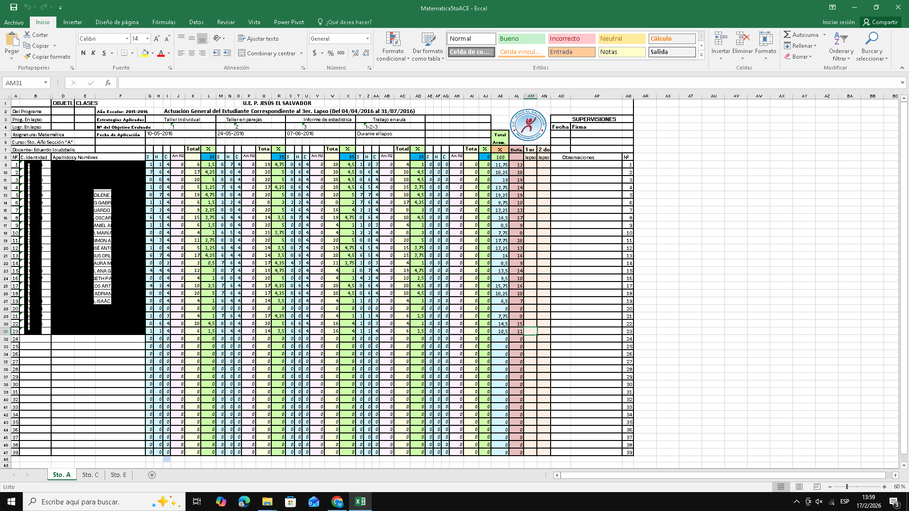
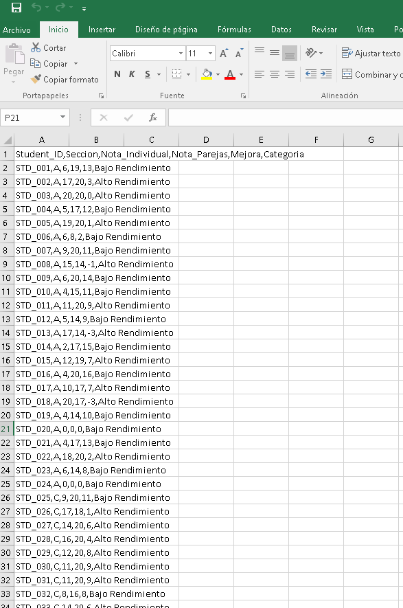
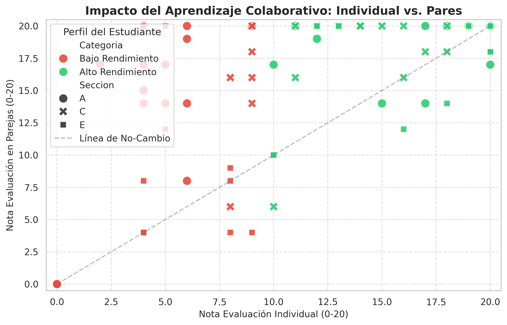

# 🎓 Educational Data Mining: Impacto del Aprendizaje Colaborativo


**Autor:** Eduardo Joudzbalis | Data Analyst & Mathematics Educator

## 📌 Resumen Ejecutivo
¿Es el trabajo en parejas una estrategia efectiva para nivelar a estudiantes con rezago matemático?

Este proyecto aplica técnicas de **Análisis de Datos** sobre registros reales de 72 estudiantes de 5to año de secundaria. El objetivo fue medir cuantitativamente el impacto de la metodología *Peer Learning* (Aprendizaje entre Pares) frente a la evaluación individual tradicional, validando la hipótesis de la "Zona de Desarrollo Próximo" (Vygotsky) mediante datos duros.

---

## 🔐 Gobernanza de Datos y Ética (PII Protection)
Dado que este dataset proviene de registros académicos reales, se aplicó un protocolo estricto de **Protección de Información de Identificación Personal (PII)**.

### El Proceso de Sanitización (ETL):
Para garantizar la privacidad, el flujo de trabajo se dividió en dos etapas:

1.  **Fase 1 (Privada):** Ingesta de archivos crudos (Excel) con nombres y cédulas. Se ejecutó un script de limpieza que eliminó las columnas sensibles y generó identificadores sintéticos (`STD_001`, `STD_002`).
2.  **Fase 2 (Pública):** Análisis sobre el dataset ya anonimizado.

> **Evidencia del Proceso:**
>
> *Fig 1. Datos Originales (Campos PII sensibles ofuscados manualmente para esta demostración).*
> 
>
> *Fig 2. Dataset Final Anonimizado (Ready for Analysis).*
> 

---

## 🛠️ Arquitectura del Proyecto & Justificación Técnica

### ¿Por qué incluimos SQL (`analysis_queries.sql`)?
Aunque Python (Pandas) es suficiente para el análisis exploratorio, este proyecto simula un entorno de **Business Intelligence real**.
* **Python** actúa como la herramienta de **ETL** (Extracción y Limpieza).
* **SQL** actúa como el **Data Warehouse**.
* El script `analysis_queries.sql` demuestra la capacidad de diseñar esquemas relacionales y extraer KPIs de negocio directamente desde la base de datos, una habilidad crítica para la integración con herramientas de BI como PowerBI o Tableau.

---

## 🔍 Key Insights (Hallazgos Clave)
El análisis de datos reveló una **asimetría positiva** en el beneficio del trabajo colaborativo:

* **Efecto Nivelador Masivo:** Los estudiantes de **Bajo Rendimiento (<10 pts)** experimentaron una mejora promedio de **+7.4 puntos** al trabajar en parejas.
* **Tasa de Rescate:** El **85%** de los estudiantes previamente reprobados lograron aprobar gracias a la dinámica colaborativa.
* **Consolidación vs. Rescate:** Mientras que los estudiantes de alto rendimiento mejoraron marginalmente (+2.4 pts, efecto techo), los estudiantes rezagados triplicaron su ganancia.

### Visualización del Impacto

*El gráfico muestra cómo los estudiantes de bajo rendimiento (puntos rojos) se desplazan significativamente hacia arriba en la evaluación grupal, superando la línea de aprobación.*

---

## 💡 Recomendaciones Estratégicas
Basado en la evidencia de los datos, se sugieren las siguientes acciones pedagógicas:

1.  **Institucionalizar el Peer Learning:** Implementar sesiones obligatorias de trabajo en pares previo a exámenes parciales para el segmento de estudiantes con promedio <10.
2.  **Parejas Estratégicas (Mentoring):** Evitar la agrupación aleatoria. Los datos sugieren que emparejar a un estudiante de "Alto Rendimiento" con uno de "Bajo Rendimiento" maximiza la ganancia del segundo sin perjudicar significativamente al primero.
3.  **Monitoreo de "Efecto Techo":** Diseñar desafíos adicionales para los estudiantes de Alto Rendimiento durante las sesiones grupales, ya que los datos muestran que su ganancia en nota es marginal (+2.4 pts) y podrían perder motivación.

---

## ⚠️ Next Steps & Limitations

### Limitaciones
* **Tamaño de la Muestra:** N=72. Aunque es estadísticamente significativo para el contexto escolar local, las conclusiones no deben generalizarse a nivel nacional sin más datos.
* **Variable Única:** Solo se analizó la variable "Calificación". No se midieron variables cualitativas como "Satisfacción del Estudiante" o "Retención del conocimiento a largo plazo".

### Próximos Pasos (V2.0)
* **Análisis Longitudinal:** Rastrear si los estudiantes "rescatados" mantuvieron su aprobación en el examen final individual (validación de aprendizaje real vs. dependencia).
* **Comparativa Inter-Materia:** Replicar el estudio en asignaturas como Física o Química para verificar si el patrón se mantiene en otras ciencias exactas.

---

## 📂 Estructura del Repositorio

```text
├── data/
│   ├── raw/                           # (NO INCLUIDO) Archivos originales protegidos
│   └── processed/
│       └── dataset_anonimizado_final.csv # Dataset público y seguro
├── notebooks/
│   ├── 01_etl_anonymization.ipynb     # Evidencia del código de limpieza y anonimización
│   └── 02_analysis_visualization.ipynb # Notebook reproducible con gráficas y KPIs
├── sql/
│   ├── schema_creation.sql            # Script DDL para crear la BDD
│   └── analysis_queries.sql           # Consultas SQL para extraer KPIs de negocio
├── images/
│   ├── raw_data_masked.png
│   ├── anonymized_preview.png
│   └── scatter_plot_impact.png
└── README.md
